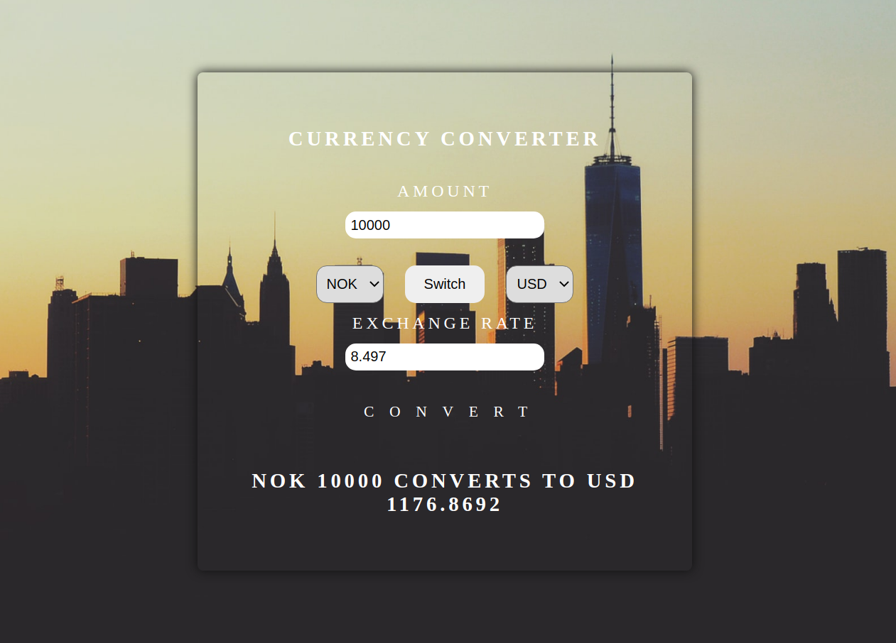

# Currency Converter

This project is bootstrapped with [Create React App](https://create-react-app.dev/).

This is a simple React project that converts the given amount with up  
to date exchange rates from the API https://api.exchangeratesapi.io/latest.

## npm start

`npm start`

Run this command after you've cd'd into the cloned  
folder. This runs the app in the development mode.  
Open http://localhost:3000 to view it in the browser.

Once rendered the result will look like the image below.  
One can easily switch background image in `index.css`
by going to [Unsplash](https://unsplash.com) and copy  
the equivalent of the link that is already there.  
That is, https://source.unsplash.com/qK6898jepEU/2400x1600/  
where `qK6898jepEU` is the photo ID which is the only thing  
you will have to copy and paste back into the link.

  

## npm run bild

`npm run build`

Builds the app for production to the `build` folder.  
It correctly bundles React in production mode and optimizes  
the build for the best performance. This is done so that  
your app is ready for deployment.

